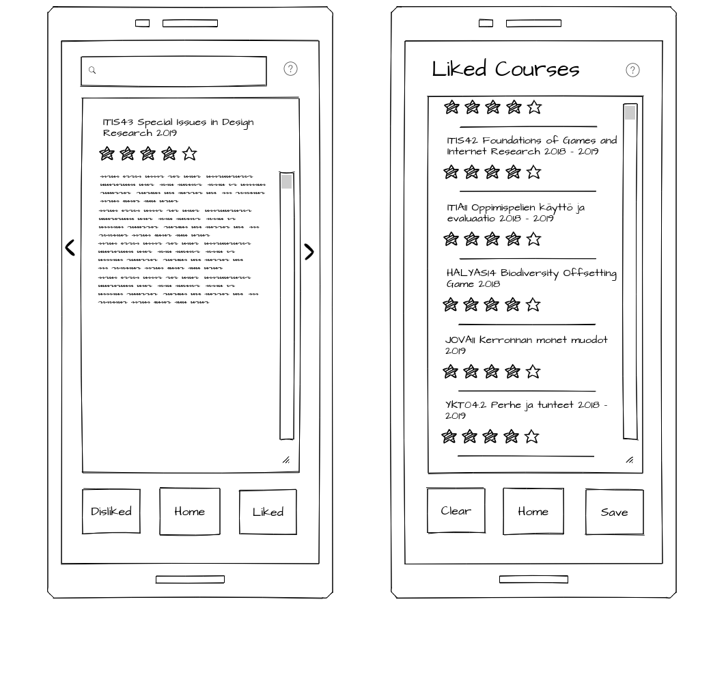

# Sovelluksen kuvaus
TODO 

# Arkkitehtuuri

## Dataputki
### Resurssit
- Jupyter notebooks
- Resource group
- Storage account (Blob storage)
- SQL Server
- Azure SQL DB
- Azure Search Service
### Vaiheet
1. Jupyter notebook tty_final_crawling.ipynb lukee Tampereen Yliopiston Hervannan kampuksen laitosten opinto-opasta ja tallentaa nämä Azuren blob storageen csv-tiedostona erikseen perus ja jatko-opinnoille, sekä näistä yhdistettynä csv-tiedostona..
2. Jupyter notebook blob_to_sql.ipynb lukee tämän yhdistetyn tiedoston datan ja syöttää sen Azure SQL tietokantaan. 
3. SQL kannasta Azure Search lukee ja indeksoi tallennettua dataa ja syöttää sitä rajapinnan kautta webbisovellukselle

## Websovellus
REACT pohjainen websovellus hakee Azuren REST -rajanpinnan kautta valmiiksi muokatun datan ja näyttää sen sivustolla. Proof of concept hahmotelma on löydettävissä kansiosa client/ajaxTest
Yksinkertaistettuna web-sovelluksen toimintaperiaate on hakea DATA puolelta saatavilla oleva data ja näyttää se korttimaisina tuloksina.

## UI -hahmotelma

# Kansiorakenne 

## Client kansio
Kansio sisältää koko web-sovelluksen lähdekoodin. Tarkempia tietoja löytyy kansion omista README -tiedostoista.

## Python notebooks
Python notebooks kansio sisältää Jupyter notebookit, joiden avulla dataputkea orkestroidaan. Notebookeista on piilotettu tunnukset ja salasanat.
Kansio pitää sisällään kaksi tiedostoa: 
- tty_final_crawling.ipynb - Raapii TTY:n opinto-opasta ja muokkaa tätä dataa. Tallentaa datat kolmeen eri csv-tiedostoon.
- blob_to_sql.ipynb - Siirtää csv-tiedostoista datat sql-kantaan.

## Terraform 
Terraform kansio pitää sisällään sovelluksen vaatiman infrastruktuurin luomiseen tarvittavat koodit.

Kansio jakautuu kahteen alikansioon: 
 - defaults -alikansio sisältää kaikki yleiset tiedot luotavaan ympäristöön liittyen eli: Azure ympäristön nimi, resurssiryhmä ja resurssien fyysinen lokaatio
 - data_infra -alikansio sisältää itse dataputken infrastruktuurin ja niiden määritykset koodina. Alikansiossa säilytetään myös Terraform hetkittäistä tilaa.

 # Kehityskohdat
 - Jupyter Notebookien muunto Azure Functioneiksi, jolloin koko dataputki voitaisiin automatisoida ja ajastaa
 - React- implementaatio, eli sisällytettään proof of concept malli ajaxTest kansiosta React sovellukseen.
 - Sovelluksen tyylittäminen (CSS)
 - Turvallisesti yhdistäminen DATA -puolelle
 - UI-mockupin toteuttaminen
